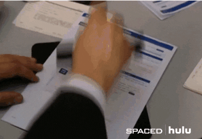
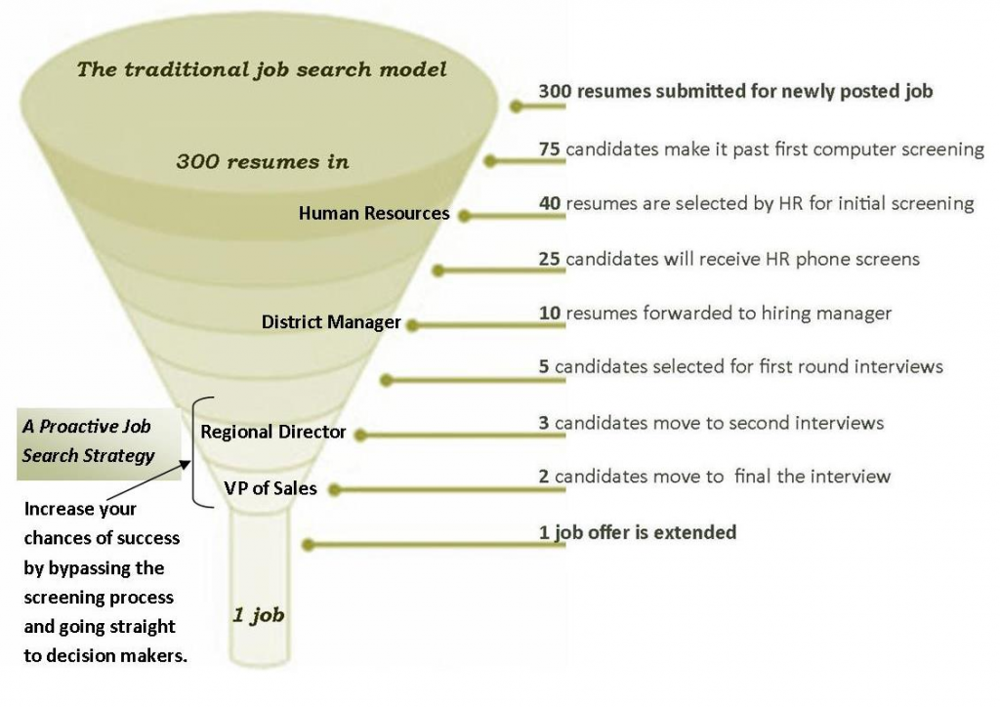

## 公司的CV Screening這關是在幹嘛？

公司端收到從收到的申請數量來看，一個職缺從收履歷、進入下一階段到最後發offer的過程就像是一個漏斗形狀，每一關會有刷掉不適合的人選並逐步晉級，最後依據適合程度發出offer。而CV Screening 就是第一關，決定是否要邀請求職者來面試。

在一般情況下，公司刊登一個職缺後通常會收到一定數量的超額申請，這時候CV Screening主要就是要過濾掉不匹配的申請，把適合的候選人轉給Hiring Manager並評估該邀請哪些求職者來面試。為了讓整體的履歷篩選作業流程更有效率，大部分公司都會採用Application Tracking System（ATS）來管理公司職缺的招募情況，並透過內部的系統來自動化篩選並淘汰掉不適合人選。

（題外話，根據報導，Google一年就會收到約兩百萬份的職缺申請，如果一份履歷用30秒看過，HR需要一整年不吃不喝不睡才能看完兩百萬封履歷。）

而求職者在這關的目的只有一個：被邀請去面試並證明自己。

## 為什麼求職者常收到拒絕信？
收到拒絕信並不一定代表示不好，因為背後的隱情可能跟大家想的不一樣。大致上可以分成三種情況

**1. 被ATS系統擋住**

通常ATS可以設定匹配程度在多少分數上，才可以往下送到Hiring Manager。若投完之後沒過多久馬上收到拒絕信，那大多數情況是是ATS系統基於關鍵字匹配程度沒達標準而判定拒絕後所發的信件。

**2. 有過ATS系統，但職缺沒了**

例如說可能這個職缺已經開了大概15天以上，公司已經收到一定的申請數量也找到相對適合的人選讓Hiring manager去挑。為了不要增加更多困擾因此公司暫時把職缺關閉。

**3. 有過ATS系統，也有被Hiring manager看到，但其他人履歷更匹配**

太多適合的人來申請也會有這種情況，這時候會優先挑可能前30位來進行面試。所以既使求職者的資歷都符合，但有其他更資深、經驗更老到的競爭對手來競爭，因此在優先順序上沒有被挑中。

## 怎麼樣提高通過機率並拿到面試邀請？
剛出社會或是到新環境時的求職過程一直都是個數字遊戲，大量地投遞履歷才有更高的機會被被邀請去面試。履歷的製作上請採用版本管理的方式。首先，有一個master主板將過往所有經歷都保留下來，並基於不同職種做不同的branch的分支。例如要申請Cloud相關的工程師崗位，只需保留最相關的內容，刪減成此類工作的master版本，接下來是根據目標公司提供的JD做關鍵字調整。

如此一來，求職者創建一個最原始的master版本保留所有的經歷 ; 在透過想爭取的工作類型，做第二階段的編修，變成此職種的master版本，最後再按照公司JD來小規模地客制。如此一來，每份申請所需花費的時間就能降低至30分鐘內，並實現能大量投遞履歷但能客製化的目標。

而根據前面被拒絕的原因，以下是對應的解決辦法：

**1. 預先評估自己履歷跟JD的匹配程度：**

既然對方是機器人，那求職者也能用機器人來對決。Jobscan可用來來做JD和履歷匹配程度的計算，讓你能不斷修改履歷至有87分像的匹配度。

**2. 訂閱目標公司職缺的RSS:** 

讓新的職缺刊登時能第一時間投遞。至於履歷的準備應隨時保持在能30分鐘內完成客製化的速度，達到機會出現能即時爭取，減少含恨的狀況。

**3. 找人內推：**

最直接有效且可以繞過ATS系統、以及HR的做法。
## 結論
求職過程一直都是個數字遊戲，大量地投遞履歷才有更高的機會被被邀請去面試。而實測以來最有用的方式還是尋找內推，透過Linkedin或是參加meetup認識業內人士，並透過邀請喝咖啡的方式建立更深度的交流，如果能引起對方的認可並且願意進行內部推薦，基本上都可以保證履歷會被看到而不會被ATS機器人給過濾掉。（ 延伸閱讀：用喝咖啡，來爭取更多的面試機會）

被拒絕怎麼辦？move on是最好的方式。求職者不斷在投遞履歷的pipeline上有下一間公司要投遞或面試，新歡有時候是忘掉舊愛的最快方式，所以讓自己的schedule滿載，讓過去失敗的經驗成為未來成功的基石！