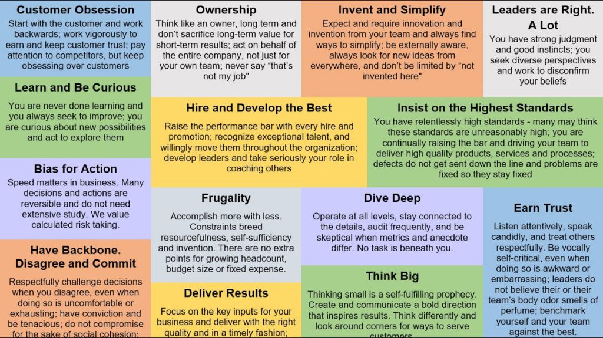
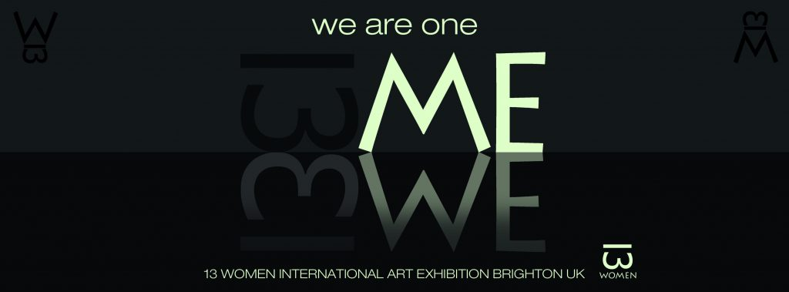

面試官：你剛剛提到若跟主管有意見不合的時候，你會據理力爭？

你/妳：當然，當自己是對的時候，德國教育告訴我們得要用去證明自己的觀點

面試官：喔？所以德國主管就算不小心犯錯你也直言不諱？

## 為什麼公司要採用行為面試？
所謂的行為面試(Behavioral Interview)，是以過去經驗為基礎，通過詢問求職者如何處理過去與工作中遇到的情況類似的問題，來衡量在未來情況下的表現。這類型的面試較常出現在外商環境，尤其顧問性質產業中，但愈來愈多的本土、新創公司也都開始採用行為面試，來應對並找出變動環境下所需要的新型人才特質，用此種類型的面試來衡量候選人，在“新角色”中的會展現的行為評估。如果你曾在面試中，被要求描述過：工作經驗中遇到的特定情況下會如何反應？如此“描述先前的情況”類型的問題，其實，就是正在進行一場“行為面試”。

目前科技公司中，Amazon最被廣為人知採用行為面試的公司，不僅僅在所有崗位都會經歷過，最後onsite的過程中，面試官們也會分配要側重的特質並於每一關都詢問相關的行為面試問題。

## 求職者常見失敗原因
**1. 個人故事太少且時常重複**

各個行為面試問題背後都代表要評量特定的面向，若求職者沒有妥善準備各種不同案例來佐證自己能反映出的核心價值，很常會重複同樣案例並沿用在不同問題上，很難讓面試官留下深刻印象。

**2. 回答只使用“我們(We)**

由於現代工作多半是團隊一起作業，所以回答時自己會常使用”我們”(we)來進行故事的解說，而亞洲人叫謙讓/害羞的性格，更是讓每一則回答都是以”我們”為主詞，鮮少使用“我”。面試官的角度想要錄取的不是整個團隊而是候選人本身，因此若太常使用”我們”，會無法讓面試官充分知道求職者個人展現了什麼樣能力並產生什麼影響力。

**3. 回答沒有結構太冗長**

許多求職者回答時會突然想要添加許多的細節，因此把第一次的回答像是寫作文一樣娓娓道來。然而，面試官通常會期盼先給予一個基本輪廓，掌握案例的基本來龍去脈，在針對內容往下深入探究。若求職者一開始就一股腦兒地滔滔不絕，面試官將很難做面試筆記，也很難評量要側重的面相而導致無法衡量，最後數據不足直接拒絕。

## 如何改進與提升？
**1. 每個側重面向準備兩個不同案例**

以亞馬遜14 Leadership Principles為例，求職者可以按照這些原則所設計的常見面試問題，準備至少兩個以上的案例作為回答的依據。同一個案例本身會涵蓋多種側重的面向，例如在詢問與”聆聽能力”有關的問題時，案例有可能會同時反應出“聆聽能力”、”同理心”及“包容”，因此求職者可以先從整理自己學習、職涯的故事開始，並從每個案例開展出涵蓋的領導力原則作為準備方式，以近一步豐富案例的深度與廣度。

**2. 知道團隊共同的決定與自己的貢獻**

既使大多數的案例都是由團隊共同商討完成的，求職者依然能從事件中抽離出自己負責的任務，並清楚分出”我們(we)”和”自己(I)”的貢獻。當知道自己的貢獻為何之後，嘗試深挖當時為何做這個決定、中間的關鍵點在哪、以及所帶來的影響力和成果。

**3. STAR原則並控制第一次回答在兩分鐘內**

由於大部分的回答都會被面試官持續追問兩到三次，因此第一次的回答除了有架構之外，更建議控制在兩分鐘之內。求職者可用STAR回答架構，讓案例以有脈絡的方式呈現，並透過中間鋪梗吸引面試官詢問設好的陷阱，慢慢地讓面試按照自己的劇本前進。

## 結論
人與人溝通有一點很重要：不在於你說了什麼，而是對方接受到什麼。有的時候我們認為自己的回答反映了面試官想要聽的重點，但很有可能只是一廂情願的想法，對方聽完有時候沒有意會到，就變成沒拿到分數。模擬面試建議找一個不算是很熟悉的人做模擬面試官，因為過於熟識可能會無法讓對方點出表達的盲點，所以，透過模擬面試，求職者更能從第三方角度來反覆打磨自己的回答，以達到有效地溝通。

### 參考資料
STAR or SAR法則： 
- https://www.youtube.com/watch?v=r8TABh8EDak
- http://www.lynncareers.com/2017/09/behavioralinterview.html
- https://www.youtube.com/watch?v=r8TABh8EDak