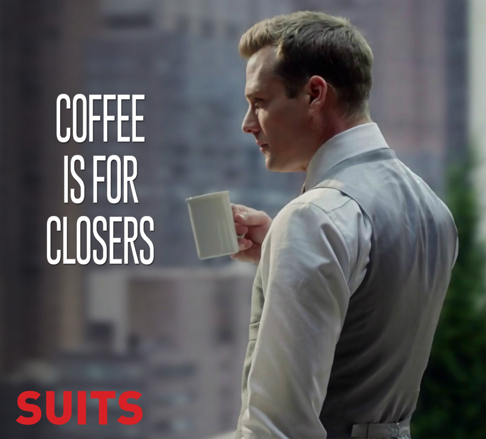

大家投履歷一定都有石沉大海，有去無回的那種經驗。有的時候不是你不夠優秀，而是Hiring Manager根本沒有機會看到你的申請就被系統或HR擋住了，所以，如何有效地提高"投遞"轉化率，會是這篇想分享的一個策略，讓你用別的管道取得面試的機會，進而才真正開啟打怪拿offer的面試準備。方法其實就是：**透過約喝咖啡，增加面對面認識的機會**

我自己用了這個方式成功約了三次喝咖啡，喝完全部都被內推並且實際onsite 面試，最後取得了一個正職的offer。

## 一起想想你有興趣的目標(公司/職業/特定人士)會出現在哪種半專業場合？

- **鎖定好標的**：  
    這裡的目標可以從公司，觀察有沒有什麼event。特定職業也會有相關的小聚，例如在web development meetup通常也會有front-end, backend, full stack的工程師參加。特定人士可以是更明確的人，也許他將在哪邊演講或是做了什麼side project在他的網站上。這三者可以互相自由搭配。
- **半專業場合：**  
    泛指不是在他自己公司，但卻跟他本身的專業有關的活動。例如：工程師去參加Google的 Google Cloud Summit。

## 一個雲計算行業的例子，你參考看看

我學習的領域是雲計算相關，所以泛指AWS, Google Cloud Platform, Azure等線下聚會，只要能去我都會騰出時間過去。在慕尼黑，我每個月會參加一些AWS的User Group Meetup。每次的meetup通常都會有使用雲計算的公司來贊助免費披薩跟啤酒，並且在活動開始時候有個廣告時間，並釋放出要招募工程師的訊息。可以運用中場休息的時間，跑去找這公司的人聊聊天，交換一下想法。如果找到的人不熟悉你想更深入瞭解的領域，你可以請他幫你介紹對的人，並且有禮貌地說聲謝謝！如果這次的演講者的背景以及要講的主題是我很有興趣的話，我會試圖爭取跟他有個簡單的交談，讓他有點印象之後，回家開始邀請他喝咖啡的下一步！

## 少用罐頭信息，多用點真誠，別人分辨得出來的

要記得，這些講者通常單天活動會跟很多人交談，也許不會記得你是誰(這有好有壞)，但他只知道他跟很多人交談記夠了。接下來就是取得對方的聯繫方式之後，把你的想邀約他喝咖啡的信息寄過去。

信息的架構你可以這樣分成四段

- **開頭：**  
    你是誰 -> 你怎麼取得他的聯繫方式/啥場合碰過面 -> 覺得他的內容很受用/有興趣......etc
- **闡述：**  
    說一下你在幹嘛(講述跟對方背景有重疊的部分，不用提到自己在找房子或是在準備考試這類無關的) -> 想從他的經驗進一步請教 -> 希望邀請喝一杯咖啡
- **行動：**  
    表達願意買咖啡去對方公司附近 -> 爭取30分鐘時間 -> 淺在可行的行程表(例如：我下兩週的週二到週四下午時間都方便) ->請對方告知哪個時間他比較方便
- **感謝：**  
    再次表達感謝以及對方時間-> 留下你的聯繫方式 -> Looking forward to your response

這裡有幾個要點，要**_盡可能地降低對方動身跟你喝咖啡的心理障礙_**。大家都一堆會議要開，所以如果對方能夠走沒幾步路就有免費咖啡喝，那意願會高一些。反之，稍有一點麻煩，對方估計不會答應甚至不會回你。而就我的經驗來看，基本上要去附近喝，對方就會說不如去他公司喝就好，嘿嘿，正中我下懷！

這類訊息普遍稱為(Cold-Email)，就類似以前在路上會遇到許多人在做陌生開發/搭訕測試/加入直銷等等，一開始是需要極大的勇氣去做，但做過幾次就也那樣。你只要保持個心態：**_有好的回應都是賺到，沒有回應那也不會變得更差_**。所以擁有一個業務的心態，可以幫你創造出很多機會。

## 就像官場一樣，其實對方也都清楚你想要幹嘛  

剛開始會想說，自己要不要假裝根本不是來爭取面試機會，好好的演一場。但說穿了，對方其實很清楚你想要什麼。所以如果對方說建議要在官網上投遞履歷的話，那就順水推舟！如果對方不是對的窗口來協助你瞭解更多資訊，請他能不能介紹公司內對的窗口，並且跟說聲謝謝！

## Summary

- **客製化訊息，但自我介紹部分可以有模板**
- **降低別人動身跟你喝咖啡的阻礙**
- **清楚掌握自己掌握的知識邊界，不要裝懂**

## 題外話：女生通常比較有優勢

我覺得女生其實還有一個更大的優勢，就是男生約男生一直都是一個非常困難的事情，尤其又是阿宅約另一個大阿宅喝咖啡，總感覺不是那麼吸引人。但是女生約女生/男生的話，無論是喝咖啡，又或者是夏天的時候去吃冰淇淋，感覺非常OK呀！各位女性的讀者看到這兒，我相信你有更多的機會可以用來爭取喝咖啡，來瞭解圈內人的一些想法，並得到更多訊息來判斷這個崗位/公司/淺在未來同事，是不是你想加入的。

下一篇跟各位分享，在喝咖啡時候的交戰守則！
