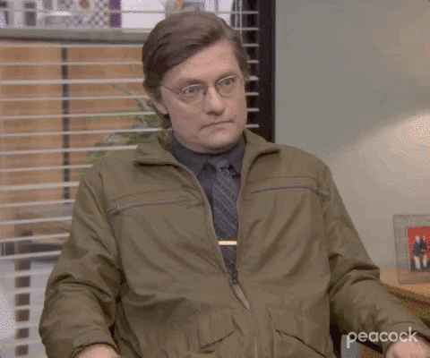

## 面試的時候，面試官們到底忙什麼？
忙著一心多用呀。

除了主觀上對求職者的感受之外，評定面試結果都是基於大量的”面試筆記”。面試官除了要確保分配到的題目都要問到之外，還要寫下筆記以紀錄求職者的回答。如果求職者這時候瘋狂地用機關槍隨意回答，面試官又得撥出額外心思來理出頭緒。更別提面試前自己正面臨要解bug或是交付產品的心理壓力。所以當面試官不一定比求職者輕鬆，可能還壓力山大。

以下站在公司、面試官的角度做兩種剖析：

**1. 公司時間成本**

從面試所投入的時間/產出來說，一個求職者讓公司花費時間和金錢是巨額的，中間投入面試的時間成本等同於佔據所有面試官們應有的職能產出。更甚者，公司給了offer但卻被求職者拒絕，讓前面所有的投入都打水漂，因此要嘛極力爭取優秀求職者接受offer，不然都是公司極大的損失。

**2.  面試官心理層面:**

坐在你眼前的面試官也許正頂著隔天要交付產品的壓力，但表面上卻得維持形象不露天機，這類內心衝突心理壓力不比求職者少。

面試官需要同時寫下大量的面試筆記之外，還要同時驗證求職者的回答是否合理、是否跑題或是在胡扯瞎扯，過程中也要不斷地去引導面試節奏。所以有時候求職者遇到回答完但面試官沒有太大反應，其實是他們正在寫上大量的面試筆記以防忘記。而這些筆記將在所有關卡結束後，成為所有人聚集在一起討論的核心材料，若有些該側重的面向沒有問到，反而會讓面試官在內部被扣分。所以當對方打斷你的回答時，代表他們有時程上的壓力得完成該問的問題。

## 所以知道面試官的處境我能怎麼樣？

當你了解面試官的處境時候，許多因對方反應而導致更緊張的情形將大幅減少，也不用事後自怨自艾。例如：面試官對我的回答沒有反應、面試官很冷淡是不是不喜歡我、面試官打斷我回答是不是我講錯了……etc。

相反的，你只需要運用有邏輯結構的方式表達，能讓面試官更輕鬆地跟上並寫成筆記，讓每個問題都能順順地問完以達到完整表現自己的成效。即使有些問題不一定回答得好，但是精準到位地表達讓時間上能完整地呈現自己其他特色，將能在溝通能力評分上創造額外的加分效果。