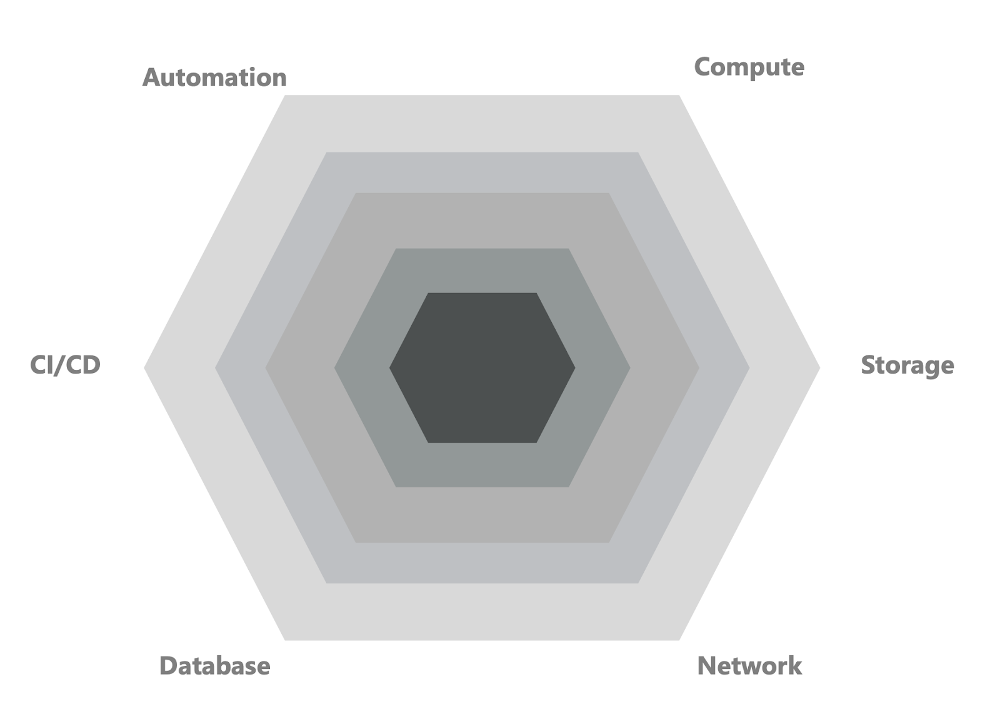

（此篇主要以軟體工程相關的崗位為主）

面試官：請問什麼是CDN?

你/妳: （恩…..）Content-Delivery-Network? 我只知道這個。

面試官：（OK，看來他只知道名詞解釋，below the bar） OK，下一題，什麼是CAP理論？

## 公司的Technical Breath這關是在探討什麼？
公司想要評估面試者本身在這份崗位上的基本戰鬥力與見識，包含對會需要設略的領域（ex: storage, compute, networking, monitoring, database……etc）是否有足夠的知識，以及有無特別感興趣或是見解的地方。而綜合起來的結果就可以想像成你的戰鬥力指數。同常會用Wh類的問題作為開場：

- What is CAP therom?
- What is the difference between relational database and non-relational database?
- What is OSI?

根據Galssdoor和blind等網站，Amazon再進行技術廣度評估的時候，會將面試者回答的答案分成三種等級(Above / Meet / Below the bar)並有對應的分數，待面試官面試結束後會得到總分並評估是否有跨越Hiring manager和公司的標準，例如：

該崗位所需要專注的領域是否有達標？(ex: database, security要合格)
整體而言此level所需要的標準是否達到水平(ex: 至少要有2個領域 above the bar並且大部分都是meet the bar)
綜合上述的標準才會決定是否要往下一關前進。

## 為什麼我很常在這關就被刷下來？
通常這關就被拒絕的原因有很多種，最不好的情況就是不懂但卻胡扯，面試官心裡會想跟你工作你唬爛我怎麼辦？直接拒絕。假設都在誠實回答的前提下，大致上也分成三大因素：

只會字面翻譯但是不知道用來解決什麼問題：例如文章最一開始被問到什麼是CDN，若你只能回答出來此字的全寫但卻不清楚此技術能帶來什麼效果，通常都是拿到below the bar的分數。畢竟這不完全是一個背多分的考試，如果機械式地把定義背出來反而印象會更不好。
只有接觸過一些領域但其他都完全沒碰過：既使有些問題你能回答得出來並且有中等水平，但是其他重要的領域若都沒有接觸過則很難過關。常見不熟的領域為：Security, monitoring, CI/CD的策略。
不夠深入：所有的問題你都可以回答得出來並且有中等水平，但是無法進入更深入的技術比較與實務經驗的分享，會讓面試官感受不到你的強項而認為不一定能為團隊帶來價值。

## 怎麼樣擴增技術廣度且同時理解本質？
首先，這並非速成可以解決的問題，必須要靠時間積累來逐步打底各種領域的知識。但也有高效的方式快速打底，讓你從0到入門並將身邊能掌握的事物進行透徹理解。實務上在進行重點式的吸收時，建議將所有的知識點彙整在同一份筆記上，每次都不斷修正這份筆記讓它趨近於更好吸收與複習。以下是你可以運用的方式

### 1. 瞭解名詞的分類以及彼此之間的關係：

軟體工程禮遇裡面有很多的縮寫，稍微不注意就會迷失在這些縮寫當中，所以你可以先釐清每個名詞的類別作為開始。我們以IaC這個名詞為例子，其全寫是Infrastructure as Code的縮寫，也可以翻譯成架構及代碼，屬於“領域類”的名詞。再IaC領域中，常見的技術工具為 Cloudformation, Terraform，分別是不同公司在IaC中所提供的工具，屬於”工具/技術類”的名詞。透過明確分類名詞之間的性質，你會更有系統的歸納不熟悉名詞之間的關係。

另一個例子是database領域，有關聯式資料庫(Relational Database)跟非關聯式資料庫(non-relational database)等等，而在關連式資料庫裡頭，MySQL是一種資料庫引擎(database engine)，而SQL是一種資料庫檢索的語言(query syntax)，不是資料庫引擎。

試圖先從同一個主題內的名詞，將其之間的從屬關係釐清，才不會陷入用蘋果跟橘子在比較的情況。

### 2. 從CV上的專案進行地毯式的整理：

首先掌握自己的作品集、專案上所使用的技術，是讓面試立於不敗的基礎。準備階段你可以按照下列框架整理CV上列的產品或專案：

背景介紹：研究主題、合作對象、應用(Application)的介紹、原本產品的tech stack
專案挑戰：過去的舊技術哪方面無法滿足？使用的情境上出現了什麼變化導致的？
解決方案：採用什麼樣新的技術？為什麼選擇這個技術？預期有什麼效果？
實際成果：預期與實際的成果有什麼樣的差距？你的客戶認為此專案成功嗎？如果還有更多時間，你會在哪方面改進此產品？
### 3. 暸解其他類似產品的架構並嘗試暸解為什麼這樣設計(nice to have)

閱讀科技公司的engineering blog你可以學習到更多。在面試公司前，你也可以去找找其他國家/市場上類似領域的佼佼者，看看他們在處理更大scale的時候，怎麼去調整產品的架構以因應更大的流量。當你很明確掌握技術的概念、範疇後，並詳加熟悉自己做過的案子，閱讀別家公司的案例將為你節省大量時間，加速成長與學習的速度。另外，同樣性質的產品在面對不同規模(scale)的狀態下，有不同的技術因應方式，你也可以利用這個機會瞭解面試公司目前處在什麼階段，以及當你加入後，如何協助對方往下一個更大規模階段做好準備，這將是重要的價值輸出。

## 結論
透過技術廣度的面試官，公司能衡量知道你在此份工作目前的的戰鬥力是否都有達到平均水平。雖然不可能每個技術都有使用過甚至是鑽研過，但至少可以先廣泛地涉略並知道其扮演的角色和解決了什麼樣的問題作為開始。以下是六個在雲端運算領域中的基礎，可以作為框展技術廣度的開始，供你參考。

